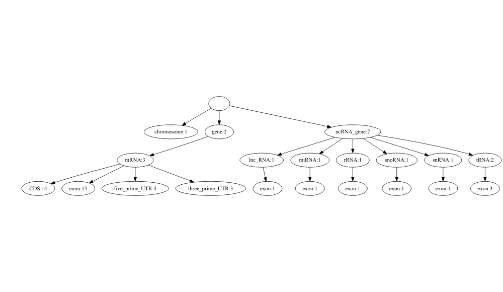

# 0\. About Rgff

**Rgff** is a R package that provides some useful tools to retrieve
statistical and hierarchical information contained in GFF files, either
*general feature format* (GFF3) or *gene transfer format* (GTF)
formatted files\[1\]. GFF3 and GTF are the most widely used data formats
for genomic annotations. **Rgff** also holds some other interesting
utilities, like convert the GTF files to the currently recommended GFF3
format, check if a GFF file is correctly formatted or generate SAF files
from GFF files. If you are not familiar with GFF3/GTF formats, please
access [this](https://www.ensembl.org/info/website/upload/gff.html),
[this](http://gmod.org/wiki/GFF3) or
[this](https://github.com/The-Sequence-Ontology/Specifications/blob/master/gff3.md)
link for a detailed information.

In summary, with **Rgff** you can:

    * Verify if the format and feature ordering of your GFF file is correct
    * Obtain relevant stats of the content of your GFF file
    * Extract the feature structure of a GFF file and export this hierarchy in a graphical chart
    * Sort an unsorted GFF file
    * Convert a GFF file into a SAF-formatted file
    * Convert a GTF file to GFF3

# 1\. Check the consistency and order of a GFF file

Let’s suppose that we are interested in obtaining diverse information
(stats, feature structure) that is contained in a given GFF file. First,
we would like to check if the file meet the conventions of a particular
GFF format.

We start loading the package:

``` r
##============================================================================##
## A    Load the library
##============================================================================##
library(Rgff)
```

As a first example, we load a GFF3 example file provided in the package
named *AthSmall.gff3*:

``` r
##============================================================================##
## B    Load first example data
##============================================================================##

dir <- system.file("extdata", package="Rgff")
gffFile1 <- file.path(dir,"AthSmall.gff3")
```

and now we check if the file is correctly GFF3-formatted:

``` r
##============================================================================##
## C    Check the consistency and order of the GFF file 
##============================================================================##

check_gff(gffFile1)
```

    ## [1] ERRORCODE MESSAGE   SEVERITY 
    ## <0 rows> (or 0-length row.names)

No errors returned. Right\! This file meets the requirements of a
well-formatted GFF3 file. Now, let’s move on to a second example, also
provided in our package:

``` r
##============================================================================##
## D    Load and check second example data
##============================================================================##

gffFile2 <- file.path(dir,"eden.gff3")

check_gff(gffFile2)
```

    ## Features are not sorted by start coordinate in 1 chromosomes

    ##                  ERRORCODE
    ## 1 NOT_SORTED_BY_COORDINATE
    ##                                                        MESSAGE SEVERITY
    ## 1 Features are not sorted by start coordinate in 1 chromosomes   MEDIUM

In this second example, *check\_gff* finds an error in the order of the
features.

Let’s see the problem:

``` r
# read the first lines of "eden.gff3" file
head(read.table(gffFile2,sep="\t",header=FALSE), n=7L)
```

    ##       V1 V2              V3   V4   V5 V6 V7 V8                            V9
    ## 1 ctg123  .            gene 1000 9000  .  +  .        ID=gene00001;Name=EDEN
    ## 2 ctg123  . TF_binding_site 1000 1012  .  +  .              Parent=gene00001
    ## 3 ctg123  .            mRNA 1050 9000  .  +  . ID=mRNA00001;Parent=gene00001
    ## 4 ctg123  .            mRNA 1050 9000  .  +  . ID=mRNA00002;Parent=gene00001
    ## 5 ctg123  .            mRNA 1300 9000  .  +  . ID=mRNA00003;Parent=gene00001
    ## 6 ctg123  .            exon 1300 1500  .  +  .              Parent=mRNA00003
    ## 7 ctg123  .            exon 1050 1500  .  +  .    Parent=mRNA00001,mRNA00002

As *check\_gff* indicated, the file is not well sorted by coordinates:
the exon in line 7 has a start position (*1050*) that is lower that the
start position (*1300*) of the mRNA in line 6.

In section [4](#sort) we will see how to fix this issue using another
function (*sort\_gff*) provided by **Rgff**.

# 2\. Getting the stats

Let’s suppose that we are interested in obtaining the names of the
features present in the first GFF3 example file, the number of items by
feature and the average, maximum and minimum size of each feature.

We can use *gff\_stats* to obtain these statistics:

``` r
##============================================================================##
## E    Obtain the stats of the GFF file
##============================================================================##
gff_stats(gffFile1)
```

    ## # A tibble: 14 × 5
    ##    FeatureType        AvgLen   MaxLen   MinLen     n
    ##    <chr>               <dbl>    <dbl>    <dbl> <int>
    ##  1 CDS                  282.      791      107    14
    ##  2 chromosome      30427670  30427670 30427670     1
    ##  3 exon                 305.     1034       35    23
    ##  4 five_prime_UTR       291.      669       83     4
    ##  5 gene                2526      2784     2268     2
    ##  6 lnc_RNA              437       437      437     1
    ##  7 miRNA                216       216      216     1
    ##  8 mRNA                2560      2784     2268     3
    ##  9 ncRNA_gene           172.      437       41     7
    ## 10 rRNA                 163       163      163     1
    ## 11 snoRNA               193       193      193     1
    ## 12 snRNA                 41        41       41     1
    ## 13 three_prime_UTR      235.      268      194     3
    ## 14 tRNA                  78        84       72     2

As it can be seen in the report, this GFF file contains 14 feature
types: *chromosome*, *CDS*, *exon*, *5’UTR*, *gene*, etc. For instance,
there are 23 *exons* in this simple GFF. This set of exons have an
average length 305, with a minimum length 35 and maximum length 1034.

Our package provides the function *gff\_stats\_by\_chr* in order to
obtain a similar statistical summary but dissaggregated by chromosome:

``` r
##============================================================================##
## F    Obtain the stats of the GFF file, disaggregated by chromosome
##============================================================================##
print(gff_stats_by_chr(gffFile1), n=50)
```

    ## # A tibble: 21 × 6
    ## # Groups:   Chr [4]
    ##    Chr   FeatureType        AvgLen   MaxLen   MinLen     n
    ##    <chr> <chr>               <dbl>    <dbl>    <dbl> <int>
    ##  1 1     CDS                  282.      791      107    14
    ##  2 1     chromosome      30427670  30427670 30427670     1
    ##  3 1     exon                 344.     1034       35    19
    ##  4 1     five_prime_UTR       291.      669       83     4
    ##  5 1     gene                2526      2784     2268     2
    ##  6 1     lnc_RNA              437       437      437     1
    ##  7 1     mRNA                2560      2784     2268     3
    ##  8 1     ncRNA_gene           238       437       84     3
    ##  9 1     snoRNA               193       193      193     1
    ## 10 1     three_prime_UTR      235.      268      194     3
    ## 11 1     tRNA                  84        84       84     1
    ## 12 2     exon                  72        72       72     1
    ## 13 2     ncRNA_gene            72        72       72     1
    ## 14 2     tRNA                  72        72       72     1
    ## 15 3     exon                 190.      216      163     2
    ## 16 3     miRNA                216       216      216     1
    ## 17 3     ncRNA_gene           190.      216      163     2
    ## 18 3     rRNA                 163       163      163     1
    ## 19 5     exon                  41        41       41     1
    ## 20 5     ncRNA_gene            41        41       41     1
    ## 21 5     snRNA                 41        41       41     1

# 3\. Extracting the feature organization of the GFF file

**Rgff** allows to extract the hierarchical feature organization of a
GFF file showing the dependency between the features. The
*get\_features* function provides an output displaying this structure in
form of a dependence tree by default:

``` r
##============================================================================##
## G    Extract the feature organization of the GFF file as a tree
##============================================================================##
get_features(gffFile1)
```

    ## Creating pairs file...

    ##                      levelName
    ## 1                             
    ## 2   ¦--chromosome             
    ## 3   ¦--gene                   
    ## 4   ¦   °--mRNA               
    ## 5   ¦       ¦--CDS            
    ## 6   ¦       ¦--exon           
    ## 7   ¦       ¦--five_prime_UTR 
    ## 8   ¦       °--three_prime_UTR
    ## 9   °--ncRNA_gene             
    ## 10      ¦--lnc_RNA            
    ## 11      ¦   °--exon           
    ## 12      ¦--miRNA              
    ## 13      ¦   °--exon           
    ## 14      ¦--rRNA               
    ## 15      ¦   °--exon           
    ## 16      ¦--snoRNA             
    ## 17      ¦   °--exon           
    ## 18      ¦--snRNA              
    ## 19      ¦   °--exon           
    ## 20      °--tRNA               
    ## 21          °--exon

As it is shown, the highest features (nodes) in the GFF are
*chromosome*, *gene* and *ncRNA\_gene* (non-coding RNA gene). Taking for
example the *gene* node, we see that it has a child node, the *mRNA*
feature. Depending from *mRNA* there are four child features, that are
siblings from each other: *CDS*, *exon*, *five\_prime\_UTR* and
*three\_prime\_UTR*.

You can obtain a more graphical view of the dependency structure of the
features. Export the tree into a plot using the *plot\_features*
function. Note that you will need to install and load previously the R
package **DiagrammeR** to use this function:

``` r
##============================================================================##
## H    Plot the dependency tree of the GFF file
##============================================================================##

#install DiagrammeR if you do not have it installed (you need to do this only once)
# install.packages("DiagrammeR")

#load DiagrammeR
library("DiagrammeR")

#plot the features tree
plot_features(gffFile1)
```


The number of occurrences of each feature type present in the file can
be added to each feature name in the plot using the
\(includeCounts = TRUE\) parameter.

``` r
##=================================================================================##
## I  Plot the dependency tree of the GFF file in PNG format (default format)
##    and include the number of items of each feature
##=================================================================================##

plot_features(gffFile1, includeCounts = TRUE)
```



The plot with the hierarchical structure of features is saved into a
file in \(png\) by default. \(pdf\) or \(svg\) formats are also allowed
by adding the chosen format in the \(exportFormat\) parameter of
**plot\_features** function and setting the output file path.

``` r
##=================================================================================##
## J  Plot the dependency tree of the GFF file in PDF format 
##=================================================================================##

# get the plot in a PDF file
outPlot1 <- file.path(tempdir(),"treeplot_from_gff3_file.pdf")
plot_features(gffFile1, outPlot1, exportFormat = "pdf", includeCounts = FALSE)
```

For the \(svg\) export format you will need to have the packages
**DiagrammeRsvg** and **rsvg** installed in addition.

``` r
# installing and loading the required packages for svg format
# install.packages("DiagrammeRsvg")
# install.packages("rsvg")

library("DiagrammeRsvg")
library("rsvg")

# get the plot in a svg file
outPlot2 <- file.path(tempdir(),"outplot_from_gff3.svg")
plot_features(gffFile1, outPlot2, exportFormat = "svg", includeCounts = TRUE)
```

Besides as a tree, **Rgff** provides two more optional formats to output
the feature structure:

  - As a dataframe:

<!-- end list -->

``` r
##============================================================================##
## K    Extract the feature organization of the GFF file in data.frame format
##============================================================================##
get_features(gffFile1, outFormat = 'data.frame', includeCounts = TRUE)
```

    ##                                                      BLOCKS          FEATURES
    ## 1                                                                chromosome:1
    ## 2  CDS:14 exon:15 five_prime_UTR:4 mRNA:3 three_prime_UTR:3            gene:2
    ## 3         CDS:14 exon:15 five_prime_UTR:4 three_prime_UTR:3            mRNA:3
    ## 4                                                                      CDS:14
    ## 5                                                                     exon:23
    ## 6                                                            five_prime_UTR:4
    ## 7                                                           three_prime_UTR:3
    ## 8   exon:8 lnc_RNA:1 miRNA:1 rRNA:1 snoRNA:1 snRNA:1 tRNA:2      ncRNA_gene:7
    ## 9                                                    exon:1         lnc_RNA:1
    ## 11                                                   exon:1           miRNA:1
    ## 13                                                   exon:1            rRNA:1
    ## 15                                                   exon:1          snoRNA:1
    ## 17                                                   exon:1           snRNA:1
    ## 19                                                   exon:3            tRNA:2

  - As JSON:

<!-- end list -->

``` r
##=================================================================================##
## L    Extract the feature organization of the GFF as JSON
##=================================================================================##
gffFile1_json_features <- get_features(gffFile1, outFormat = 'JSON')
strsplit(gffFile1_json_features,"\\n");
```

    ## [[1]]
    ##  [1] "{"                                                                        
    ##  [2] " \"features\": {"                                                         
    ##  [3] " \"1\": [ \"\", \"chromosome\" ],"                                        
    ##  [4] "\"2\": [ \"mRNA CDS exon five_prime_UTR three_prime_UTR\", \"gene\" ],"   
    ##  [5] "\"3\": [ \"CDS exon five_prime_UTR three_prime_UTR\", \"mRNA\" ],"        
    ##  [6] "\"4\": [ \"\", \"CDS\" ],"                                                
    ##  [7] "\"5\": [ \"\", \"exon\" ],"                                               
    ##  [8] "\"6\": [ \"\", \"five_prime_UTR\" ],"                                     
    ##  [9] "\"7\": [ \"\", \"three_prime_UTR\" ],"                                    
    ## [10] "\"8\": [ \"lnc_RNA exon miRNA rRNA snoRNA snRNA tRNA\", \"ncRNA_gene\" ],"
    ## [11] "\"9\": [ \"exon\", \"lnc_RNA\" ],"                                        
    ## [12] "\"11\": [ \"exon\", \"miRNA\" ],"                                         
    ## [13] "\"13\": [ \"exon\", \"rRNA\" ],"                                          
    ## [14] "\"15\": [ \"exon\", \"snoRNA\" ],"                                        
    ## [15] "\"17\": [ \"exon\", \"snRNA\" ],"                                         
    ## [16] "\"19\": [ \"exon\", \"tRNA\" ] "                                          
    ## [17] "} "                                                                       
    ## [18] "}"

# 4\. Sorting GFF files

Many operations involving GFF files, from indexing to browsing, require
the GFF to be sorted. In a well structured GFF file, all the children
features always follow their parents in a single chunk (for example, all
exons of a transcript are put after their parent “transcript” feature
line and before any other “transcript” line). The function *sort\_gff*
produces a well-structured sorted GFF file from a GFF input file that is
ill-structured/unsorted.

By default, *sort\_gff* generates a sorted file named as the input file
(without extension) plus the suffix “.sorted.gff3” or “.sorted.gtf”
depending if the input is a GFF3 or GTF file.

In previous section [1](#check), we checked a GFF3 file (*eden.gff3*)
that turned out to be incorrectly ordered. We can now sort this file and
see if the new ordered file pass the “correctness” validation.

``` r
##=================================================================================##
## M  Sort an unsorted GFF file
##=================================================================================##

#sorts the unsorted file gffFile2 (eden.gff3)
gffFile2_sorted <- sort_gff(gffFile2)

# check if the sorted file is well-formatted
check_gff(gffFile2_sorted)
```

    ## [1] ERRORCODE MESSAGE   SEVERITY 
    ## <0 rows> (or 0-length row.names)

``` r
# let's take a look to the sorted file
head(read.table(gffFile2_sorted,sep="\t"), n=10L)
```

    ##        V1 V2              V3   V4   V5 V6 V7 V8                            V9
    ## 1  ctg123  .            gene 1000 9000  .  +  .        ID=gene00001;Name=EDEN
    ## 2  ctg123  . TF_binding_site 1000 1012  .  +  .              Parent=gene00001
    ## 3  ctg123  .            mRNA 1050 9000  .  +  . ID=mRNA00001;Parent=gene00001
    ## 4  ctg123  .            mRNA 1050 9000  .  +  . ID=mRNA00002;Parent=gene00001
    ## 5  ctg123  .            exon 1050 1500  .  +  .    Parent=mRNA00001,mRNA00002
    ## 6  ctg123  .             CDS 1201 1500  .  +  0  ID=cds00001;Parent=mRNA00001
    ## 7  ctg123  .             CDS 1201 1500  .  +  0  ID=cds00002;Parent=mRNA00002
    ## 8  ctg123  .            mRNA 1300 9000  .  +  . ID=mRNA00003;Parent=gene00001
    ## 9  ctg123  .            exon 1300 1500  .  +  .              Parent=mRNA00003
    ## 10 ctg123  .             CDS 3000 3902  .  +  0  ID=cds00001;Parent=mRNA00001

Indeed, *sort\_gff* has produced a sorted file that is correctly ordered
by coordinates and this new file meets now all the criteria of a
well-formatted GFF3 file, as indicated by *check\_gff*.

# 5\. Convert a GFF file to a SAF file

The *“simplified annotation format”* (SAF) is a format that is used by
the *featureCounts* function of the **Rsubread** R package as an
alternative to GFF3/GTF formats. It also contains information about the
feature types needed to quantify reads generated from either RNA or DNA
sequencing technologies. It is simpler than GFF formats and includes
only five required tab-delimited columns for each feature: feature
identifier, chromosome name, start position, end position and strand. As
in the case of the GTF format, features sharing the same feature
identifier are taken to belong to the same “group-by” feature
(“meta-feature”, in the Rsubread nomenclature). To obtain more
information of the package **featureCounts** and a description of the
SAF format see:
<https://www.rdocumentation.org/packages/Rsubread/versions/1.22.2/topics/featureCounts>.

**Rgff** provides a function to convert a GFF file to SAF format,
*saf\_from\_gff*. This function requires to have the package
**rtracklayer** previously installed (see
<https://bioconductor.org/packages/release/bioc/html/rtracklayer.html>)

For example, the simplest use of this function would be to obtain a SAF
compiling only the lines of the GFF3 that refers the feature “gene”. For
that, you only need to put this feature name in the vector required by
the *features* parameter:

``` r
##============================================================================##
## N    Convert a GFF file to SAF format, only the "gene" feature
##============================================================================##

safFileConverted <- saf_from_gff(gffFile1, features = c("gene"))

read.table(safFileConverted,sep="\t",header=TRUE)
```

    ##           GeneID Chr Start   End Strand Notes
    ## 1 gene:AT1G01010   1  3631  5899      +  gene
    ## 2 gene:AT1G01110   1 51953 54737      +  gene

You can compile in a SAF the intervals belonging to more than one
feature by adding all the feature names of interest to the *features*
vector. For example, for “gene” plus “ncRNA-gene”:

``` r
##================================================================================##
## O    Convert a GFF file to SAF format, both "gene" and "ncRNA_gene" features
##================================================================================##

safFileConverted2 <- saf_from_gff(gffFile1, features = c("gene","ncRNA_gene"))

read.table(safFileConverted2,sep="\t",header=TRUE)
```

    ##           GeneID Chr    Start      End Strand      Notes
    ## 1 gene:AT1G01010   1     3631     5899      +       gene
    ## 2 gene:AT1G01110   1    51953    54737      +       gene
    ## 3 gene:AT1G04817   1  3575377  3575814      + ncRNA_gene
    ## 4 gene:AT1G05997   1  9076445  9076638      - ncRNA_gene
    ## 5 gene:AT1G56930   1 21278647 21278731      + ncRNA_gene
    ## 6 gene:AT2G36600   2 15346160 15346232      + ncRNA_gene
    ## 7 gene:AT3G18217   3  6244500  6244716      - ncRNA_gene
    ## 8 gene:AT3G41979   3 14199753 14199916      + ncRNA_gene
    ## 9 gene:AT5G02255   5  4690371  4690412      - ncRNA_gene

Some features, like “gene”, are constructs that have constituent
sub-features underneath. We name these sub-features “blocks”. All the
blocks belonging to a particular meta-feature share the same feature ID.
With *saf\_from\_gff* you can extract a SAF containing the information
of a particular block type for each meta-feature type. A usual example
is to get all the exons grouped by their corresponding genes (genes
would be the “group\_by” or “meta-feature” in this case). Use the
notation \((group\_by\_feature > block\_feature)\) in the *features*
parameter vector to achieve this grouping in the resulting SAF file:

``` r
##============================================================================##
## P    Convert a GFF file to SAF format, compiling "exons by gene"
##============================================================================##

safFileConverted3 <- saf_from_gff(gffFile1, features = c("gene > exon"))

read.table(safFileConverted3,sep="\t",header=TRUE)
```

    ##            GeneID Chr Start   End Strand      Notes
    ## 1  gene:AT1G01010   1  3631  3913      + exon->gene
    ## 2  gene:AT1G01010   1  3996  4276      + exon->gene
    ## 3  gene:AT1G01010   1  4486  4605      + exon->gene
    ## 4  gene:AT1G01010   1  4706  5095      + exon->gene
    ## 5  gene:AT1G01010   1  5174  5326      + exon->gene
    ## 6  gene:AT1G01010   1  5439  5899      + exon->gene
    ## 7  gene:AT1G01110   1 51953 52346      + exon->gene
    ## 8  gene:AT1G01110   1 52061 52730      + exon->gene
    ## 9  gene:AT1G01110   1 52434 52730      + exon->gene
    ## 10 gene:AT1G01110   1 52938 53183      + exon->gene
    ## 11 gene:AT1G01110   1 53484 53624      + exon->gene
    ## 12 gene:AT1G01110   1 53703 54689      + exon->gene
    ## 13 gene:AT1G01110   1 53703 54737      + exon->gene

As it is shown in the output, the first line contains the annotation of
an exon belonging a gene (indicated in the column “Note” by the
expression *exon-\>gene*) named AT1G01010. This exon sits on chromosome
1, from position 3631 to 3913. Lines 1 to 6 share the same GeneID and
group all the exons that depend on that gene (AT1G01010).

\(c(\texttt{"gene > exon"})\) is the default value of the *features*
parameter, so you don’t need to make it explicit:

``` r
safFileConverted4 <- saf_from_gff(gffFile1)
```

You can use other separator character distinct from “\>” between
group\_by feature and block feature, by declaring the alternative
separator with the *sep* parameter. For example:

``` r
safFileConverted5 <- saf_from_gff(gffFile1, features = c("gene : exon"), sep = ':')
```

You may be interested in compiling more than a pair “group\_by feature
\> block feature” in one single SAF file. To do that, you should write,
separated by comma, all the pairs in the vector of the parameter
*feature*. In the example below, we obtain a new SAF containing both
“exons by genes” (\(gene > exon\)) and “exons by non-coding genes”
(\(ncRNA\_gene > exon\)):

``` r
##==============================================================================##
## Q    Convert a GFF file to SAF format, compiling "exons by gene"  
##      and "exons by non-coding RNA genes"
##==============================================================================##

safFileConverted6 <- saf_from_gff(gffFile1, features = c("gene > exon","ncRNA_gene > exon"))

read.table(safFileConverted6,sep="\t",header=TRUE)
```

    ##            GeneID Chr    Start      End Strand            Notes
    ## 1  gene:AT1G01010   1     3631     3913      +       exon->gene
    ## 2  gene:AT1G01010   1     3996     4276      +       exon->gene
    ## 3  gene:AT1G01010   1     4486     4605      +       exon->gene
    ## 4  gene:AT1G01010   1     4706     5095      +       exon->gene
    ## 5  gene:AT1G01010   1     5174     5326      +       exon->gene
    ## 6  gene:AT1G01010   1     5439     5899      +       exon->gene
    ## 7  gene:AT1G01110   1    51953    52346      +       exon->gene
    ## 8  gene:AT1G01110   1    52061    52730      +       exon->gene
    ## 9  gene:AT1G01110   1    52434    52730      +       exon->gene
    ## 10 gene:AT1G01110   1    52938    53183      +       exon->gene
    ## 11 gene:AT1G01110   1    53484    53624      +       exon->gene
    ## 12 gene:AT1G01110   1    53703    54689      +       exon->gene
    ## 13 gene:AT1G01110   1    53703    54737      +       exon->gene
    ## 14 gene:AT1G04817   1  3575377  3575814      + exon->ncRNA_gene
    ## 15 gene:AT1G05997   1  9076445  9076638      - exon->ncRNA_gene
    ## 16 gene:AT1G56930   1 21278647 21278684      + exon->ncRNA_gene
    ## 17 gene:AT1G56930   1 21278696 21278731      + exon->ncRNA_gene
    ## 18 gene:AT2G36600   2 15346160 15346232      + exon->ncRNA_gene
    ## 19 gene:AT3G18217   3  6244500  6244716      - exon->ncRNA_gene
    ## 20 gene:AT3G41979   3 14199753 14199916      + exon->ncRNA_gene
    ## 21 gene:AT5G02255   5  4690371  4690412      - exon->ncRNA_gene

# 6\. Convert a GTF to a GFF3 file

Even today it is not uncommon to find gene feature files in the older
GTF format instead of the currently recommended GFF3 format. Our package
admits files in GTF format as input for all the described functions:
check\_gff, get\_features, gff\_stats, gff\_stats\_by\_chr, sort\_gff
and saf\_from\_gff.

As a supplementary functionality, **Rgff** provides a function,
*gtf\_to\_gff3* to perform the conversion from the . This way, in the
case you are provided with a file GTF-formatted you can still make use
of the functionalities of **Rgff** by previously converting that GTF to
a GFF3-formatted file.

For example, let’s convert the example GTF file *AthSmall.gtf* (provided
in our package) to a GFF3 file:

``` r
##============================================================================##
## R    Convert from GTF to GFF3
##============================================================================##

# load and show our example GTF file
gtfFile1 <- file.path(dir,"AthSmall.gtf")
head(read.table(gtfFile1,sep="\t"))
```

    ##   V1        V2             V3   V4   V5 V6 V7 V8
    ## 1  1 araport11           gene 3631 5899  .  +  .
    ## 2  1 araport11     transcript 3631 5899  .  +  .
    ## 3  1 araport11           exon 3631 3913  .  +  .
    ## 4  1 araport11 five_prime_utr 3631 3759  .  +  .
    ## 5  1 araport11            CDS 3760 3913  .  +  0
    ## 6  1 araport11    start_codon 3760 3762  .  +  0
    ##                                               V9
    ## 1                            gene_id AT1G01010; 
    ## 2 gene_id AT1G01010; transcript_id AT1G01010.1; 
    ## 3 gene_id AT1G01010; transcript_id AT1G01010.1; 
    ## 4 gene_id AT1G01010; transcript_id AT1G01010.1; 
    ## 5 gene_id AT1G01010; transcript_id AT1G01010.1; 
    ## 6 gene_id AT1G01010; transcript_id AT1G01010.1;

``` r
# convert the GTF format to GFF3 format
gffFileConverted <- gtf_to_gff3(gtfFile1)
```

``` r
# show the results of the conversion
head(read.table(gffFileConverted,sep="\t"))
```

    ##   V1        V2             V3   V4   V5 V6 V7 V8
    ## 1  1 araport11           gene 3631 5899  .  +  .
    ## 2  1 araport11     transcript 3631 5899  .  +  .
    ## 3  1 araport11           exon 3631 3913  .  +  .
    ## 4  1 araport11 five_prime_utr 3631 3759  .  +  .
    ## 5  1 araport11            CDS 3760 3913  .  +  0
    ## 6  1 araport11    start_codon 3760 3762  .  +  0
    ##                                       V9
    ## 1                          ID=AT1G01010;
    ## 2        ID=AT1G01010.1;Parent=AT1G01010
    ## 3           ID=exon_1;Parent=AT1G01010.1
    ## 4 ID=five_prime_utr_1;Parent=AT1G01010.1
    ## 5            ID=CDS_1;Parent=AT1G01010.1
    ## 6    ID=start_codon_1;Parent=AT1G01010.1

1.  <font size="2">*GTF format is in fact equivalent to GFF version 2,
    so we use “GFF” in this document as a global name to refer any of
    both formats, GTF or GFF3*</font>
